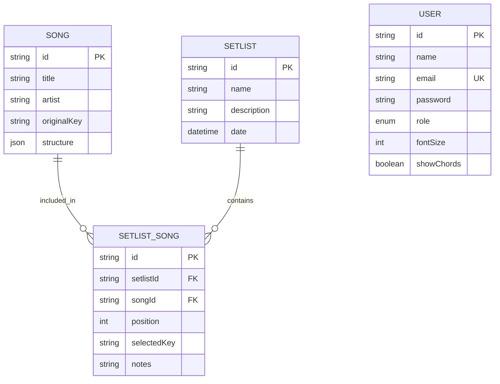

# Database Spec

## Stack
- **Engine**: PostgreSQL
- **ORM**: Prisma
- **Puerto**: 5433 (según entorno local)

## Modelo de Entidad-Relación

## Entidades

### 1. User
Almacena la información de los integrantes del ministerio y sus preferencias de lectura.
- **Roles**: `VOCAL`, `MUSICIAN`, `ADMIN`.
- **Preferencias**: `fontSize` y `showChords` permiten persistir la experiencia de usuario entre dispositivos (omitiendo la necesidad de reconfigurar en cada uso).

### 2. Song
El catálogo maestro de canciones.
- **Structure**: Campo JSON que guarda el parseo de letras y acordes. Esta es la fuente de verdad para el algoritmo de transposición.

### 3. Setlist
Representa un evento, ensayo o culto. Agrupa un conjunto ordenado de canciones.

### 4. SetlistSong (Tabla Intermedia)
Crucial para la flexibilidad del app. Permite que una misma canción sea usada en diferentes eventos con configuraciones distintas.
- **selectedKey**: Define el tono específico para ese evento (el músico verá la transposición calculada automáticamente basada en este campo).
- **position**: Determina el orden de la lista.

## Decisiones Técnicas
- **UUID**: Se utilizan strings UUID para los IDs para garantizar unicidad y facilitar futuras sincronizaciones.
- **Integridad Referencial**: Se utiliza `onDelete: Cascade` en la relación de `SetlistSong`, asegurando que no queden registros huérfanos si se elimina una canción o un setlist.
