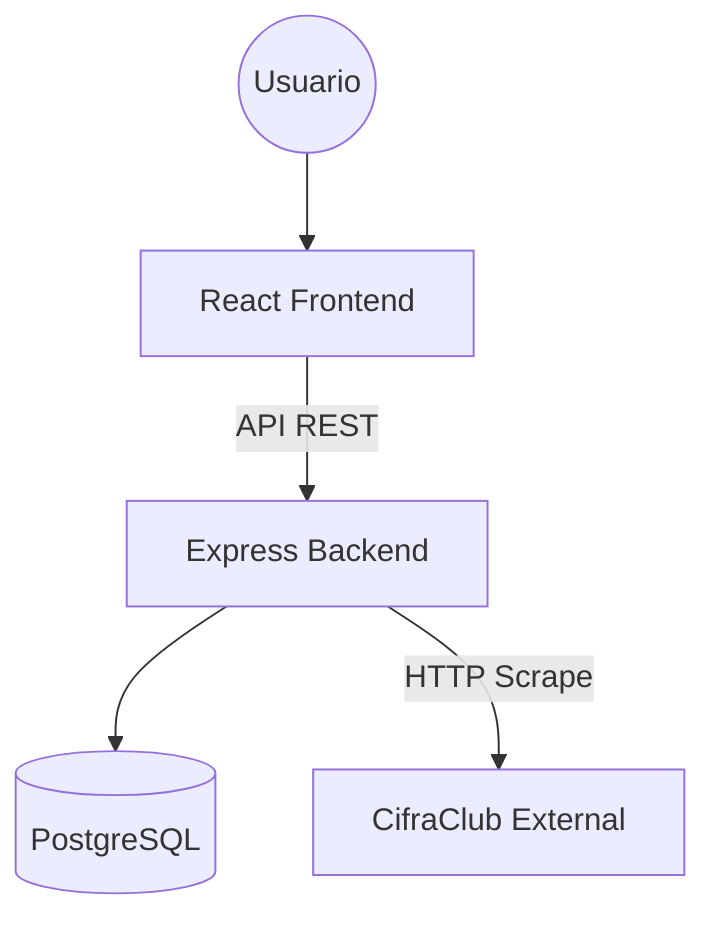

# SDD (Software Design Document)

## Stack Tecnológico
- **Frontend**: React + Vite (Optimizado para rapidez de carga).
- **Backend**: Node.js + Express (Arquitectura REST).
- **Base de Datos**: PostgreSQL + Prisma ORM.
- **Styling**: TailwindCSS con diseño adaptativo.

---

## Arquitectura de Sistema
El sistema utiliza una arquitectura **Cliente-Servidor** desacoplada.

---

## Flujo de Datos: Ingesta de Canciones
1. **Petición**: El usuario envía una URL de CifraClub al Backend.
2. **Scraping**: El Backend (`scraper.js`) realiza un fetch y extrae título, artista, tono y texto bruto usando Regex.
3. **Parsing**: El `parser.js` convierte el texto bruto en un objeto JSON estructurado (secciones, líneas, acordes).
4. **Persistencia**: La canción se guarda en la base de datos vinculando el JSON (`structure`) con sus metadatos.

---

## Lógica Musical y Transposición
- **Cálculo**: La transposición se calcula mediante un mapa de la escala cromática.
- **Dinamismo**: El Frontend aplica el `offset` de semitonos al array de acordes en tiempo real, permitiendo cambios instantáneos sin recargar la página.
- **Preservación**: No se modifica el `originalKey`, solo se calculan vistas alternativas a partir de ella.

---

## Seguridad y Acceso
- **Auth**: Autenticación mediante **JWT** (JSON Web Tokens) y hasheo de claves con **Bcrypt**.
- **Roles (RBAC)**:
    - `ADMIN`: Control total de usuarios y catálogo.
    - `MUSICIAN`: Acceso a acordes y transposición.
    - `VOCAL`: Vista simplificada (solo letra).

---

## Despliegue e Infraestructura
*   **Entorno actual**: Despliegue **Local**.
*   **Servicios**:
    - Backend: Node.js (Puerto 3000 por defecto).
    - Database: PostgreSQL (Puerto 5433).
    - Frontend: Vite Dev Server.
*   **Persistencia**: La base de datos es persistente localmente mediante el volumen de PostgreSQL configurado.
